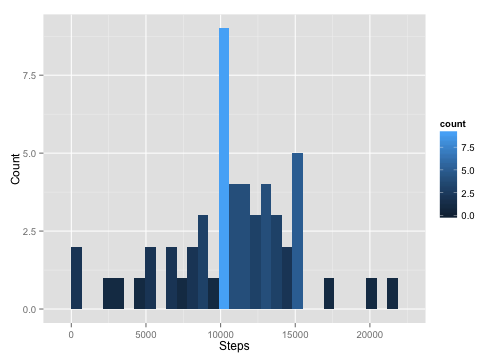
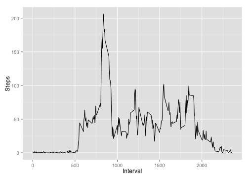
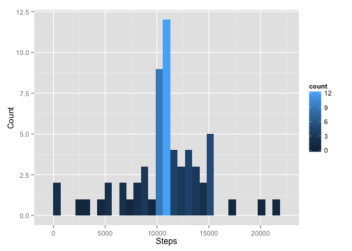
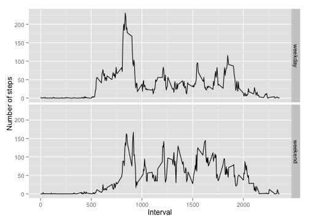

Reproducible Research: Peer Assessment 1
========================================

This report will analyze personal movement data from a personal activity monitoring device. The device collects data at 5 minute intervals through out the day. The [dataset](https://d396qusza40orc.cloudfront.net/repdata%2Fdata%2Factivity.zip) includes 3 variables:

* **steps**: Number of steps taking in a 5-minute interval (missing
    values are coded as `NA`)
* **date**: The date on which the measurement was taken in YYYY-MM-DD
    format
* **interval**: Identifier for the 5-minute interval in which
    measurement was taken

Before doing the data analysis below, we have to set up the R **knitr** option


```r
# set global chunk options: images will be 7x5 inches
knitr::opts_chunk$set(fig.width=7, fig.height=5, fig.path='figures/plot-')

# load ggplot2 package
library(ggplot2)
```

## Loading and preprocessing the data

We're going to unzip the data file and read in data. Then we will preprocess data by using Hadley Wickham's **dplyr** package. 


```r
# unzip the data file
unzip("activity.zip")

# read in data and convert it into special data frame
library(dplyr)
```

```
## 
## Attaching package: 'dplyr'
## 
## The following objects are masked from 'package:stats':
## 
##     filter, lag
## 
## The following objects are masked from 'package:base':
## 
##     intersect, setdiff, setequal, union
```

```r
myData <- tbl_df(read.csv("activity.csv", header=TRUE))

# inspect the data
myData
```

```
## Source: local data frame [17,568 x 3]
## 
##    steps       date interval
## 1     NA 2012-10-01        0
## 2     NA 2012-10-01        5
## 3     NA 2012-10-01       10
## 4     NA 2012-10-01       15
## 5     NA 2012-10-01       20
## 6     NA 2012-10-01       25
## 7     NA 2012-10-01       30
## 8     NA 2012-10-01       35
## 9     NA 2012-10-01       40
## 10    NA 2012-10-01       45
## ..   ...        ...      ...
```


## What is mean total number of steps taken per day?

In this data analysis, the "steps" data are aggregated by `summarize` "steps" `group_by` each day. Then the aggregated "steps" data are plotted as histogram. And **mean** and **median** total number of steps taken per day are calculated.


```r
# group data by date, exclusing missing data NA
#   Ref:http://www.r-bloggers.com/dplyr-example-1/
byDate <- group_by(filter(myData, !is.na(steps)), date)

# sum steps of each day
sumStep <- summarize(byDate, steps=sum(steps))

# plot histogram of the total number of steps taken each day
h <- ggplot(sumStep, aes(x=steps)) + xlab("Steps") + ylab("Count")
h + geom_histogram(aes(fill = ..count..))
```

```
## stat_bin: binwidth defaulted to range/30. Use 'binwidth = x' to adjust this.
```

 

```r
# calculate mean and median total number of steps per day
stepMean <- mean(sumStep$steps)
cat("Mean total number of steps per day = ", sprintf("%.2f", stepMean), "\n")
```

```
## Mean total number of steps per day =  10766.19
```

```r
stepMedian <- median(sumStep$steps)
cat("Median total number of steps per day = ", stepMedian, "\n") 
```

```
## Median total number of steps per day =  10765
```


## What is the average daily activity pattern?

In this data analysis, the "steps" data are aggregated by `summarize` "steps" `group_by` each 5-minute interval. Then the aggregated "steps" data are plotted against the intervals. And the 5-minute interval of **maximum** average number of steps is reported here.


```r
# group data by interval, exclusing missing data NA
#   Ref:http://www.r-bloggers.com/dplyr-example-1/
byInterval <- group_by(filter(myData, !is.na(steps)), interval)

# average steps of each interval across days, excluding missing data NA
avgStep <- summarize(byInterval, steps=mean(steps))

# plot the average number of steps in each interval
ggplot(data=avgStep, aes(x=interval, y=steps)) + 
  xlab("Interval") + ylab("Steps") +
  geom_line()
```

 

```r
# find the interval with the max average number of steps
#   Ref: http://stackoverflow.com/questions/24237399/how-to-select-the-rows-with-maximum-values-in-each-group-with-dplyr
maxStep <- avgStep %>% top_n(n=1)
```

```
## Selecting by steps
```

```r
cat("The interval with the max average number of steps is:", maxStep$interval, "\n")
```

```
## The interval with the max average number of steps is: 835
```

## Imputing missing values

In this data analysis, we're going to calculate the row number of missing data. Then we'll try to fill the missing data with the the mean steps for that 5-minute interval. For the filled complete data, we'll plot a histogram of the total number of steps taken each day and Calculate and report the mean and median total number of steps taken per day.


```r
# count the number of rows with missing data NA
numRowMissing <- sum(!complete.cases(myData))
cat("The number of rows that have missing data", numRowMissing, "\n")
```

```
## The number of rows that have missing data 2304
```

```r
# create temp data table by replacing NA with average number of steps 
# for that 5-minute interval
#   Ref: http://stackoverflow.com/questions/24459752/can-dplyr-package-be-used-for-conditional-mutating
tmp <- myData %>% mutate(newSteps = ifelse(is.na(steps), round(avgStep$steps), steps))

# select columns to make new data set
#   Ref: http://stackoverflow.com/questions/21502465/replacement-for-rename-in-dplyr
myNewData <- select(tmp, steps = newSteps, date, interval)
# group new data by date
newByDate <- group_by(myNewData, date)
# calculate new total number of steps taken each day
newSumStep <- summarize(newByDate, steps=sum(steps))

# Make a histogram of the total number of steps taken each day on new data set
newH <- ggplot(newSumStep, aes(x=steps)) + xlab("Steps") + ylab("Count")
newH + geom_histogram(aes(fill = ..count..))
```

```
## stat_bin: binwidth defaulted to range/30. Use 'binwidth = x' to adjust this.
```

 

```r
# calculate mean and median total number of steps per day
newStepMean <- mean(newSumStep$steps)
cat("New mean total number of steps per day = ", sprintf("%.2f", newStepMean), "\n")
```

```
## New mean total number of steps per day =  10765.64
```

```r
newStepMedian <- median(newSumStep$steps)
cat("New median total number of steps per day = ", newStepMedian, "\n")
```

```
## New median total number of steps per day =  10762
```

From the result above, we know these values differ from the estimates from the first part of the assignment. The imputing missing data on the estimates of the total daily number of steps makes these numbers larger.


## Are there differences in activity patterns between weekdays and weekends?

In this data analysis part, we are going to compare the activity patterns between weekdays and weekends in the new data set. The `weekdays()` function is used to convert date to weekday or weekend. The `ggplot` function plots the weekday and weekend pattern vertivally.


```r
# add weekday or weekend levels to filled new data set
#   Ref: http://stackoverflow.com/questions/1169248/r-function-for-testing-if-a-vector-contains-a-given-element
myWeekData <- mutate(myNewData, days = ifelse(weekdays(as.Date(myNewData$date), abbreviate=TRUE) %in% c('Sun', 'Sat'), 'weekend', 'weekday'))

# group by weekday/weekend and interval
byDayInterval = group_by(myWeekData, days, interval)

# the average number of steps taken in 5-minute interval, 
# averaged across all weekday days or weekend days
weekAvgStep <- summarize(byDayInterval, steps=mean(steps))

# plot to compare weekday and weenend patterns
#   Ref: http://www.cookbook-r.com/Graphs/Facets_(ggplot2)/
ggplot(weekAvgStep, aes(x=interval, y=steps)) + 
  ylab("Number of steps") + xlab("Interval") +
  geom_line() + 
  facet_grid(days ~ .)
```

 
